

  <picture>
    <source media="(prefers-color-scheme: dark)" srcset="logo/lab-bro_logo_dark.png">
    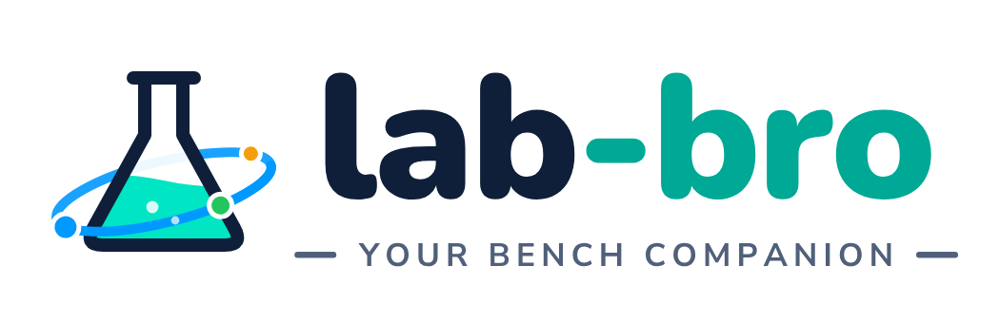
  </picture>

  
  
  

  
  

**One HTML file. Your whole bench.** Inventory, custom databases, protocols, an
experiment notebook and a drawer full of molecular-biology calculators — no server,
no account, no sign-up. Everything lives in your own browser, on your own computer.

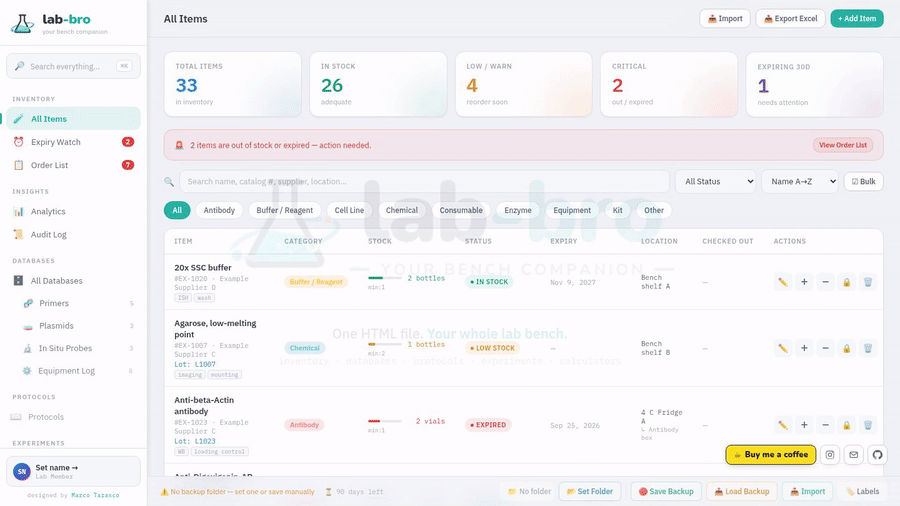

## ⬇️ Get it

Download **`lab-bro.html`** from the [**Releases**](https://github.com/MarcoTarasco/Lab-bro/releases/latest) page,
then just double-click it. That's the whole installation.

It works offline, straight from your hard drive — Excel import/export included
(the spreadsheet engine is baked into the file).

**A few house rules**

- Your data is stored in that browser's local storage, so open Lab-Bro from the
  **same file path in the same browser** each time, and it will be there.
- Nothing is ever uploaded anywhere. There is no cloud, and no one else can see it.
- Because it is browser storage, clearing your browsing data clears Lab-Bro. Set a
  backup folder in Settings and hit **💾 Save Backup** regularly — it writes a full
  JSON (exact restore) plus a readable Excel workbook.

---

## 🧪 Inventory

Reagents, consumables and equipment in one list: quantities, lots, expiry,
location, supplier and hazard tags. Filter by category — chemicals, enzymes, kits,
antibodies… and the instruments, right next to the reagents.

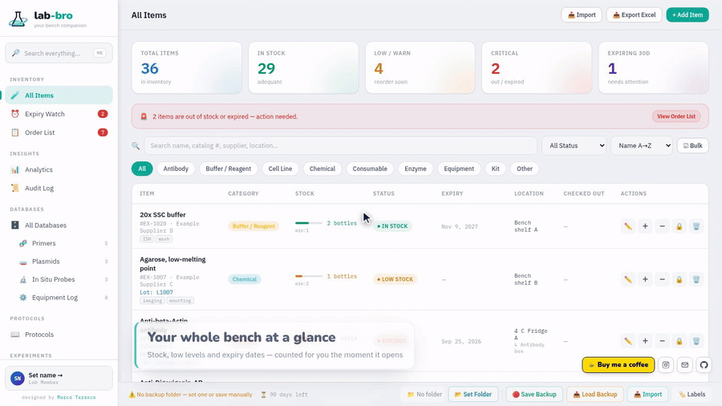

Click any item — anywhere on its row — to see its whole record; edit it in one click.

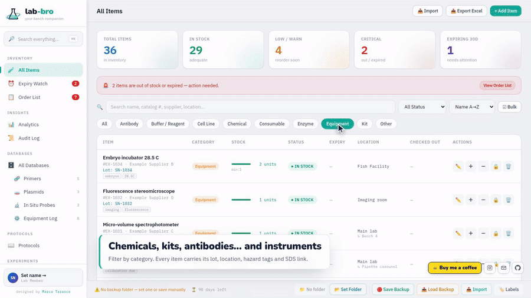

Find things as you type: name, catalog number, supplier, location.

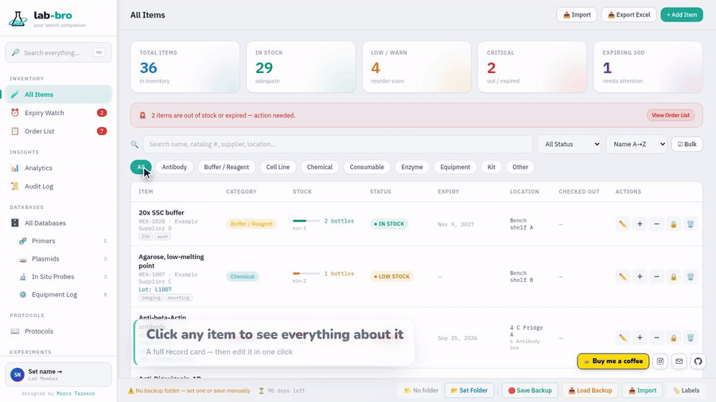

Everything below its minimum lands in an **order list** you can export…

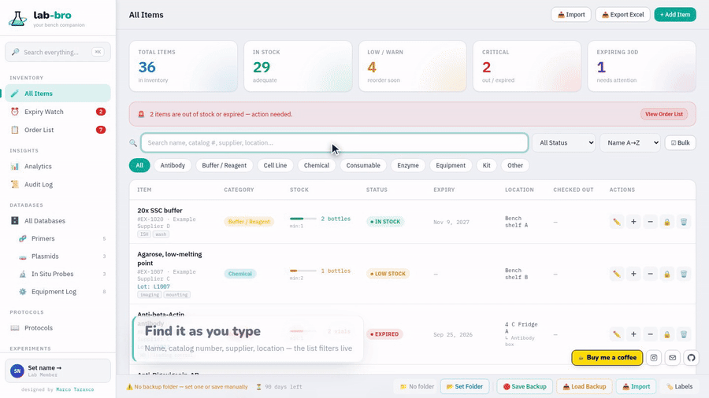

…and everything about to expire (or already expired) has its own watch list.

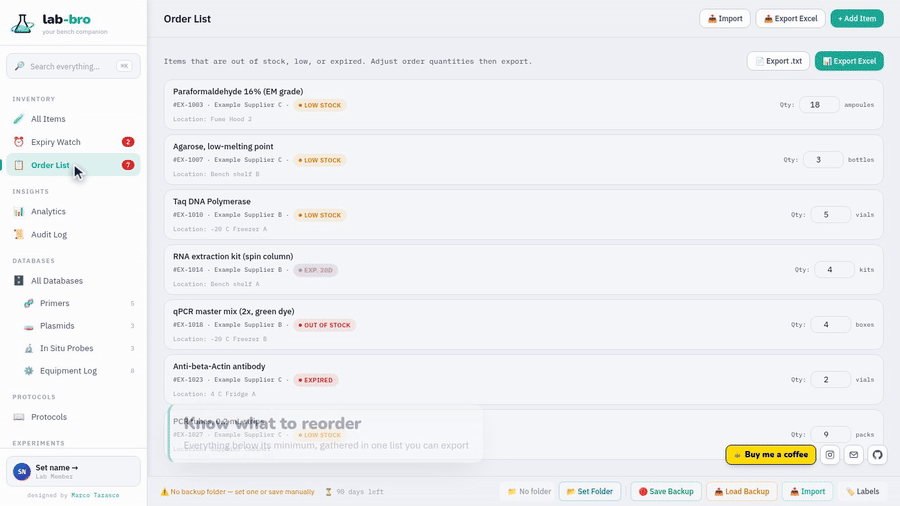

---

## 🔎 Search everything

**Ctrl/⌘ + K** finds anything, anywhere — items, database records, protocols,
recipes and experiments — from one box.

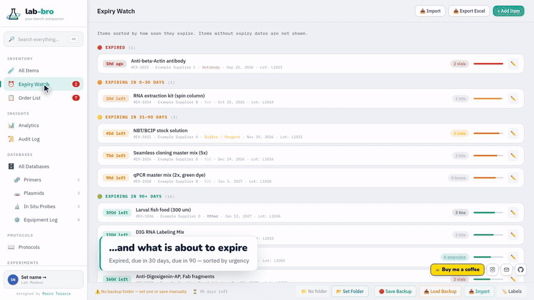

---

## 🗄️ Databases

Build your own tables — equipment logs, primers, plasmids, probes, fish lines —
with your own columns, batch editing, and Excel/CSV/JSON import & export.
Anything with a sequence column also gets primer QC and a duplicate finder.

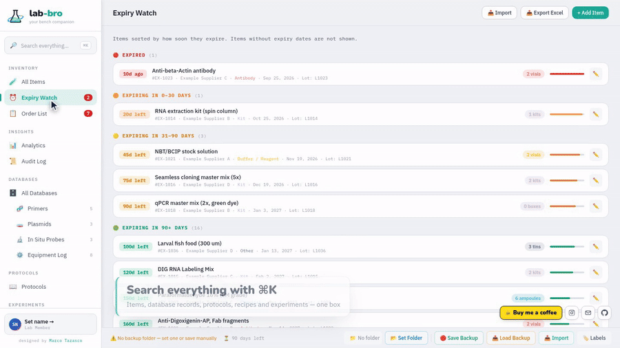

---

## 📖 Protocols

Write a protocol once, then run it from the screen: every protocol becomes a
**tickable checklist** with coloured day sections, and the progress is saved — a
three-day protocol survives going home in between. Print a clean bench copy
whenever you prefer paper.

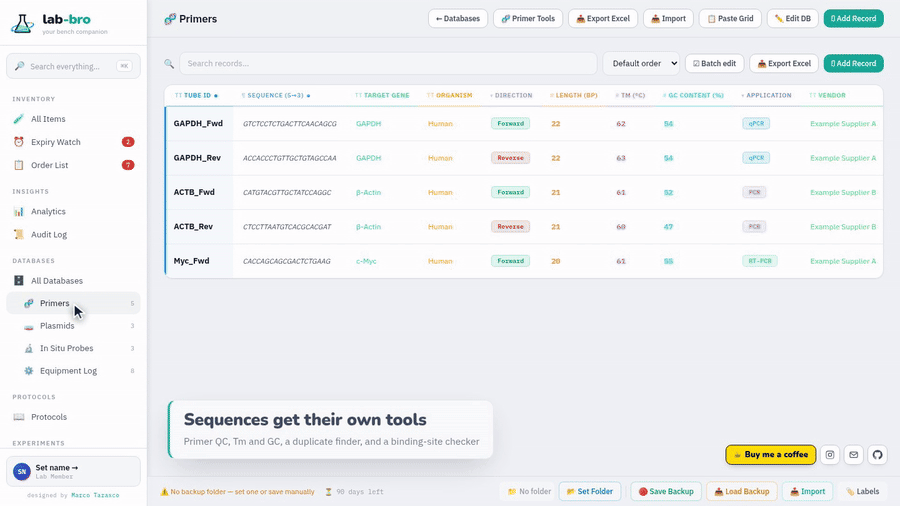

---

## 📓 Experiments

A light lab notebook: date, tags, status and notes — plus an **Excel-like grid with
sheet tabs**. Paste straight from a spreadsheet, keep the results on one tab and the
PCR setup on the next. Import a pile of .xlsx files and each becomes an experiment.

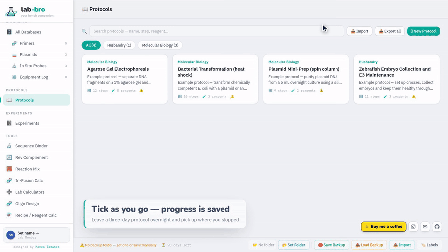

---

## ⚗️ Calculators

Save a master mix once and scale it to any number of reactions; work out exact
microlitres for **In-Fusion** or **NEBuilder HiFi** assemblies; scale solution
recipes; add the flanks for sgRNAs or in-situ probes — plus C1V1, molarity,
dilutions, oligo resuspension and ng↔pmol.

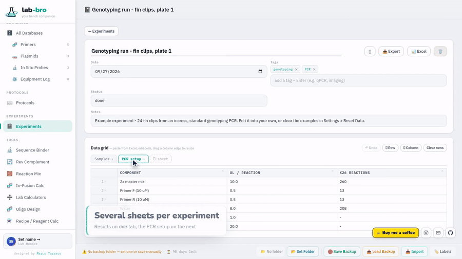

---

## 🎨 Make it yours

Ten themes and a colour picker for every part of the screen.

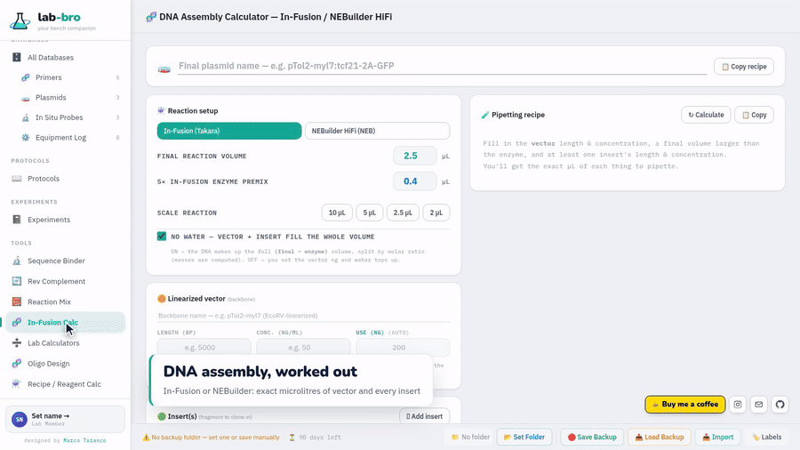

---

## 🌱 What you get on first open

Lab-Bro starts with example data so nothing is a blank page: ~36 example items
(chemicals, enzymes, kits, buffers, antibodies, consumables, equipment) from
made-up suppliers, example primer / plasmid / probe / equipment-log databases, four
example protocols, two recipes and two example experiments.

They are only there to show what goes where — clear them in one click under
**Settings › Reset Data**, or simply edit them into your own work.

---

## ⏳ Trial & access codes

This build runs as a **90-day trial**, counted from the first time you open it. The
footer shows how many days are left.

When the time is up, the app is replaced by a lock screen: **nothing is deleted**,
your data stays in the browser, and you can still download a copy of it from that
screen. A valid access code starts a fresh 90 days.

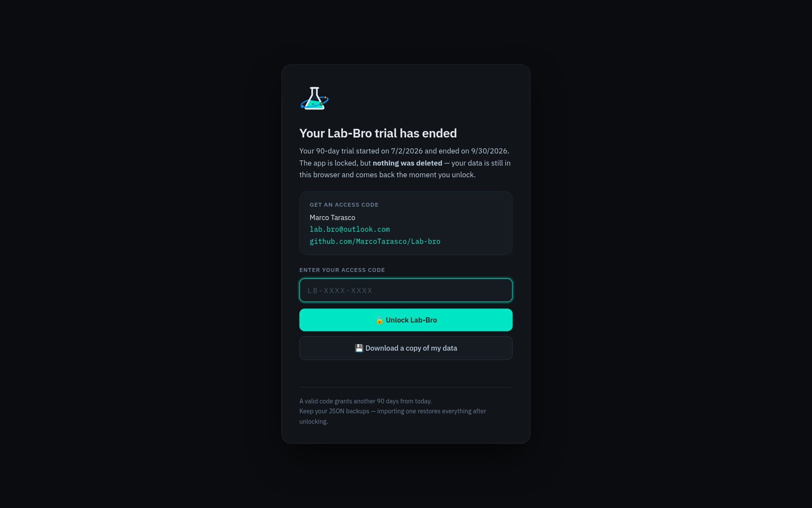

**Want a code?** Write to **[lab.bro@outlook.com](mailto:lab.bro@outlook.com)**.

---

## 💬 Help, feedback & support

- **Questions, ideas or a bug?** Write to **[lab.bro@outlook.com](mailto:lab.bro@outlook.com)** —
  or open an [Issue](https://github.com/MarcoTarasco/Lab-bro/issues).
- **Follow along** on Instagram:
  [@lab.bro.your.bench.companion](https://www.instagram.com/lab.bro.your.bench.companion).
- **Like it?** Lab-Bro is built by one scientist in spare time. A coffee keeps it going:

  

---

## 📜 Credits & licences

Lab-Bro includes **SheetJS Community Edition** (Apache License 2.0) for Excel
import/export and uses the **IBM Plex** and **Nunito** fonts (SIL Open Font License
1.1). Full notices and licence texts — including the tools used to make the
screenshots and videos — are in **[THIRD_PARTY_NOTICES.md](THIRD_PARTY_NOTICES.md)**.

Kit and product names mentioned in the calculators belong to their owners; Lab-Bro
is not affiliated with them.

---

## ⚖️ Licence

Lab-Bro is © 2026 Marco Tarasco and licensed under the
**[PolyForm Strict License 1.0.0](LICENSE)**: free to use for any **non-commercial**
purpose — research, teaching, personal use, non-profit organisations — but you may not
modify it or share your own copies. Want to use it commercially, or redistribute it?
Write to **[lab.bro@outlook.com](mailto:lab.bro@outlook.com)**.

---

Lab-Bro v1 · single-file web app · © 2026 Marco Tarasco · <a href="https://github.com/MarcoTarasco/Lab-bro">github.com/MarcoTarasco/Lab-bro</a>
